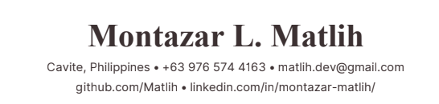

# Montazar L. Matlih

**Cavite, Philippines** • **+63 976 574 4163** • **matlih.dev@gmail.com**  
[github.com/Matlih](https://github.com/Matlih) • [linkedin.com/in/montazar-matlih](https://linkedin.com/in/montazar-matlih/) • [researchgate.net/profile/Montazar-Matlih](https://www.researchgate.net/profile/Montazar-Matlih) • [lablab.ai/u/@matlih](https://lablab.ai/u/@matlih)

---

## EDUCATION

**National University (NU-D)** — Cavite, Philippines  
*Bachelor of Science in Computer Science, Specialization in Machine Learning (BSCS-ML)* | Expected 2027  
- **Honors & Recognition:** 1st Place Champion, Project IMPACT; DOST Calabarzon & DSWD Endorsee; 3× Invited STEM Speaker
- **Relevant Coursework:** Edge AI & Computer Vision, Multi-Agent Systems, Natural Language Processing, Deep Learning & Neural Networks, Cryptography & Systems Security, Distributed Systems, Data Structures & Algorithms

---

## TECHNICAL SKILLS

- **Programming Languages:** Python, Rust, TypeScript, JavaScript, SQL, C/C++, Bash
- **AI & Machine Learning:** Multi-Agent LLM Orchestration (LangGraph), Vision-Language Models (Qwen2-VL, Qwen-VL), Model Compression & Quantization (INT8 Dynamic Quantization), Foundation Models (IBM/NASA Prithvi-100M), Edge Computer Vision (YOLO11, PatchCore), Multimodal Fine-Tuning (LoRA), OpenCV, XGBoost, Transformers.js
- **Systems & Edge Computing:** Bare-metal GPU Provisioning (AMD Instinct MI300X, ROCm 6.0), LLM Serving (vLLM), Edge Device Deployment, FastAPI, WebSockets, Linux/Unix, Embedded Systems
- **UI & UX Architecture:** Tauri (v2), React, Vite, TypeScript, Tailwind CSS, REST APIs, Vercel Serverless, Web Audio API
- **Security & Cryptography:** Argon2id Key Derivation, ChaCha20-Poly1305 AEAD, Steganography (LSB/EOF file injection), Zero-Knowledge Vault Architecture, BIP-39 Passphrase Standards

---

## PROFESSIONAL & ENTREPRENEURIAL EXPERIENCE

**ChipSentinel** — Cavite, Philippines  
*Founder & Lead AI Architect* | May 2026 – Present  
- Founded and architected an industrial edge-deployed visual anomaly detection platform for semiconductor and PCB fabrication lines to intercept micro-defects prior to packaging.
- Implemented a two-stage hybrid inspection architecture combining PatchCore for high-speed edge feature anomaly localization with Qwen-VL for contextual scene-level defect reasoning.
- Provisioned and benchmarked on bare-metal AMD Instinct MI300X (192GB HBM3) running ROCm 6.0, serving high-throughput real-time inference via FastAPI and an interactive React monitoring console.

**Blacksite Node** — Open-Source  
*Lead Security Systems Developer* | May 2026 – Present  
- Engineered a zero-knowledge local password vault and encrypted notepad in Rust and Tauri v2 with strict memory-hard constraints, local-first isolation, and zero-trust IPC boundaries.
- Implemented defense-in-depth cryptographic primitives including Argon2id key derivation, ChaCha20-Poly1305 AEAD authenticated encryption, and an emergency cryptographic duress protocol.
- Integrated an NLP-based password entropy evaluator moving beyond traditional rule-based meters, dual LSB/EOF steganographic export, and multi-lingual BIP-39 mnemonic generation across 12,288 words in 6 languages.

**Prod** — Open-Source  
*Systems Developer & FOSS Author* | July 2026 – Present  
- Designed and published a high-performance minimalist desktop productivity timer enforcing the 90/15 Ultradian rhythm with near-zero CPU and memory footprint.
- Developed a native Rust backend utilizing Tauri IPC for persistent multi-monitor window state memory, hardware-accelerated 60fps animations, and custom-synthesized Web Audio API alert chimes.

---

## FLAGSHIP TECHNICAL PROJECTS

**ShellWise Smart Bin — Edge Waste Classifier (Project IMPACT)** | April 2026  
*Lead ML Engineer | NU-D × REZBIN*  
- Won **1st Place** at NU-D × REZBIN Hackathon; earned official endorsement from the Department of Science and Technology (DOST Calabarzon) and DSWD for regional public sector edge-AI deployment.
- Engineered and deployed an ultra-compact YOLO11n object classification pipeline optimized for resource-constrained edge hardware for sub-second automated waste sorting.

**Project ARK — Autonomous Reconnaissance Kinematics** | May 2026  
*AI Systems Architect | AMD Developer Hackathon*  
- Engineered an agentic satellite disaster-response pipeline compressing emergency damage assessment turnaround from 72–96 manual hours to **under 60 seconds**.
- Orchestrated LangGraph multi-agent workflows routing optical telemetry from ESA Sentinel-2 L2A and NASA EONET through IBM/NASA Prithvi-100M geospatial foundation models and Qwen-VL.
- Executed inference on bare-metal AMD Instinct MI300X / ROCm 6.0; coupled geospatial feature embeddings with XGBoost classifiers to output immediate tactical relief directives.

**Ocular Sentinel — Autonomous C4ISR Security System** | July 2026  
*Distributed Systems Engineer | AMD Developer Hackathon: ACT II*  
- Designed a distributed edge-to-cloud tactical surveillance architecture bridging edge detection tripwires with deep cloud multimodal vision reasoning.
- Deployed lightweight YOLO11n on edge nodes with circular frame buffers, streaming triggered anomalous timelapses over WebSockets to a ROCm-accelerated Qwen2-VL model on vLLM for zero-shot tactical incident reporting.

**TSEK — Real-Time Cross-Lingual Fact-Checking System** | July 2026  
*Lead Full-Stack ML Engineer | UNESCO Youth Hackathon*  
- Built a cross-lingual, privacy-preserving Chrome extension and web application delivering real-time claim verification with **92.2% peak accuracy**.
- Applied 8-bit dynamic quantization (INT8) to mDeBERTa-v3-base, compressing model footprint by **75% (1.12 GB → ~280 MB)** for client-side in-browser inference via Transformers.js.
- Deployed a client-side gatekeeper discarding conversational noise locally, selectively querying Vercel Serverless and Gemini API only for verifiable empirical statements.

**Aerial Vehicle Detection Pipeline** | June 2025  
*Lead Computer Vision Researcher | Academic Capstone & Technical Publication*  
- Trained and evaluated an aerial-perspective computer vision pipeline achieving **94.2% mAP@50** across 9 fine-grained vehicle classes on a custom annotated dataset.
- Authored and published technical research report documenting architecture, ablation benchmarks, and optimization strategies on ResearchGate (DOI: 10.13140/RG.2.2.31747.46888).

---

## HONORS, AWARDS & SPEAKING ENGAGEMENTS

- **1st Place Champion**, Project IMPACT — NU-D × REZBIN Hackathon (Apr 2026)
- **Regional Deployment Endorsement**, Department of Science and Technology (DOST Calabarzon) & DSWD (Apr 2026)
- **Finalist / Contributor**, AMD Developer Hackathons (Project ARK, Ocular Sentinel) — Bare-metal AMD MI300X / ROCm (May & Jul 2026)
- **Competitor**, UNESCO Youth Hackathon 2026 — TSEK Smart Credibility Companion (Jul 2026)
- **3× Invited Technical Speaker**, National University Dasmariñas STEM Career Fair (A.Y. 2024–25, 2025–26) & Campus Tour (A.Y. 2025–26):
  - Delivered live technical demonstration of *JARVIS Vision* (multimodal voice-activated edge assistant with YOLO11n and Edge TTS).
  - Delivered live technical demonstration of *Cultural Garment Detection* (rapid-inference YOLO11 pipeline for traditional apparel).
